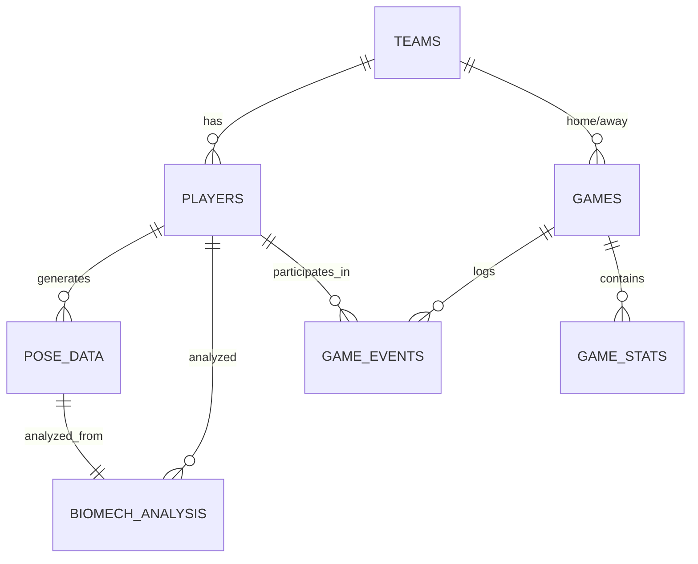

# 🏗️ Data Models Documentation

## Overview

Blaze Sports Intel uses a comprehensive data model architecture designed for high-performance sports analytics, biomechanics analysis, and machine learning pipelines. This document outlines all data models, relationships, and schema definitions.

## 📊 Database Schema Overview

### Core Entity Relationships



## 🏈 Core Models

### Teams Model

**Table:** `teams`

Stores information about sports teams across different leagues.

```sql
CREATE TABLE teams (
    id SERIAL PRIMARY KEY,
    name VARCHAR(100) NOT NULL,
    sport VARCHAR(50) NOT NULL,
    league VARCHAR(50),
    division VARCHAR(50),
    abbreviation VARCHAR(10),
    city VARCHAR(100),
    state VARCHAR(50),
    country VARCHAR(50) DEFAULT 'USA',
    established_year INTEGER,
    stadium_name VARCHAR(200),
    stadium_capacity INTEGER,
    primary_color VARCHAR(7),  -- Hex color code
    secondary_color VARCHAR(7),
    logo_url TEXT,
    website_url TEXT,
    social_media JSONB,  -- {twitter, instagram, facebook, etc.}
    metadata JSONB,      -- Additional team-specific data
    created_at TIMESTAMP DEFAULT CURRENT_TIMESTAMP,
    updated_at TIMESTAMP DEFAULT CURRENT_TIMESTAMP
);

-- Indexes for performance
CREATE INDEX idx_teams_sport ON teams(sport);
CREATE INDEX idx_teams_league ON teams(league);
CREATE INDEX idx_teams_division ON teams(division);
```

**TypeScript Interface:**
```typescript
interface Team {
  id: number;
  name: string;
  sport: 'MLB' | 'NFL' | 'NBA' | 'NCAA' | 'HS';
  league?: string;
  division?: string;
  abbreviation?: string;
  city?: string;
  state?: string;
  country: string;
  establishedYear?: number;
  stadiumName?: string;
  stadiumCapacity?: number;
  primaryColor?: string;
  secondaryColor?: string;
  logoUrl?: string;
  websiteUrl?: string;
  socialMedia?: {
    twitter?: string;
    instagram?: string;
    facebook?: string;
  };
  metadata?: Record<string, any>;
  createdAt: Date;
  updatedAt: Date;
}
```

### Players Model

**Table:** `players`

Stores athlete information and profiles.

```sql
CREATE TABLE players (
    id SERIAL PRIMARY KEY,
    team_id INTEGER REFERENCES teams(id) ON DELETE SET NULL,
    external_id VARCHAR(100),  -- ID from external APIs
    name VARCHAR(200) NOT NULL,
    jersey_number INTEGER,
    position VARCHAR(50),
    birth_date DATE,
    height_cm DECIMAL(5,2),
    weight_kg DECIMAL(5,2),
    dominant_hand VARCHAR(10) CHECK (dominant_hand IN ('left', 'right', 'both')),
    years_pro INTEGER,
    college VARCHAR(200),
    high_school VARCHAR(200),
    hometown VARCHAR(200),
    country VARCHAR(50) DEFAULT 'USA',
    draft_year INTEGER,
    draft_round INTEGER,
    draft_pick INTEGER,
    salary_usd DECIMAL(12,2),
    contract_years INTEGER,
    injury_history JSONB[],
    physical_metrics JSONB,  -- Additional measurements
    performance_notes TEXT,
    status VARCHAR(20) DEFAULT 'active' CHECK (status IN ('active', 'injured', 'retired', 'suspended')),
    created_at TIMESTAMP DEFAULT CURRENT_TIMESTAMP,
    updated_at TIMESTAMP DEFAULT CURRENT_TIMESTAMP
);

-- Indexes
CREATE INDEX idx_players_team_id ON players(team_id);
CREATE INDEX idx_players_position ON players(position);
CREATE INDEX idx_players_status ON players(status);
CREATE INDEX idx_players_external_id ON players(external_id);
```

**TypeScript Interface:**
```typescript
interface Player {
  id: number;
  teamId?: number;
  externalId?: string;
  name: string;
  jerseyNumber?: number;
  position?: string;
  birthDate?: Date;
  heightCm?: number;
  weightKg?: number;
  dominantHand?: 'left' | 'right' | 'both';
  yearsPro?: number;
  college?: string;
  highSchool?: string;
  hometown?: string;
  country: string;
  draftYear?: number;
  draftRound?: number;
  draftPick?: number;
  salaryUsd?: number;
  contractYears?: number;
  injuryHistory?: Array<{
    date: Date;
    type: string;
    severity: string;
    description: string;
    daysOut?: number;
  }>;
  physicalMetrics?: {
    wingspan?: number;
    verticalJump?: number;
    fortyYardDash?: number;
    benchPress?: number;
    [key: string]: any;
  };
  performanceNotes?: string;
  status: 'active' | 'injured' | 'retired' | 'suspended';
  createdAt: Date;
  updatedAt: Date;
}
```

### Games Model

**Table:** `games`

Stores game/match information and results.

```sql
CREATE TABLE games (
    id SERIAL PRIMARY KEY,
    external_id VARCHAR(100),
    home_team_id INTEGER REFERENCES teams(id) NOT NULL,
    away_team_id INTEGER REFERENCES teams(id) NOT NULL,
    season INTEGER NOT NULL,
    week INTEGER,
    game_date DATE NOT NULL,
    game_time TIME,
    timezone VARCHAR(50) DEFAULT 'America/New_York',
    venue VARCHAR(200),
    home_score INTEGER DEFAULT 0,
    away_score INTEGER DEFAULT 0,
    status VARCHAR(50) DEFAULT 'scheduled',
    inning_period INTEGER,
    clock_time VARCHAR(20),
    attendance INTEGER,
    weather JSONB,  -- {temperature, conditions, wind, etc.}
    officials JSONB,  -- Array of officials
    broadcast_info JSONB,  -- TV/streaming info
    game_notes TEXT,
    metadata JSONB,  -- Additional game-specific data
    created_at TIMESTAMP DEFAULT CURRENT_TIMESTAMP,
    updated_at TIMESTAMP DEFAULT CURRENT_TIMESTAMP,
    
    CONSTRAINT check_different_teams CHECK (home_team_id != away_team_id)
);

-- Indexes
CREATE INDEX idx_games_date ON games(game_date);
CREATE INDEX idx_games_home_team ON games(home_team_id);
CREATE INDEX idx_games_away_team ON games(away_team_id);
CREATE INDEX idx_games_season ON games(season);
CREATE INDEX idx_games_status ON games(status);
CREATE INDEX idx_games_external_id ON games(external_id);
```

### Game Events Model

**Table:** `game_events`

Captures the atomic sequence of on-field actions (pitches, plays, substitutions, review outcomes) for each game. Designed to power real-time feeds, analytics, and replay reconstruction.

```sql
CREATE TABLE game_events (
    id BIGSERIAL PRIMARY KEY,
    game_id INTEGER NOT NULL REFERENCES games(id) ON DELETE CASCADE,
    sequence INTEGER NOT NULL,
    event_code VARCHAR(50) NOT NULL,
    event_type VARCHAR(100) NOT NULL,
    event_subtype VARCHAR(100),
    description TEXT,
    inning INTEGER,
    half VARCHAR(10) CHECK (half IN ('top', 'bottom')), -- Baseball-specific period context
    outs INTEGER CHECK (outs BETWEEN 0 AND 3),
    home_score INTEGER,
    away_score INTEGER,
    player_id INTEGER REFERENCES players(id) ON DELETE SET NULL,
    assisting_player_id INTEGER REFERENCES players(id) ON DELETE SET NULL,
    baserunners JSONB,          -- {first: player_id, second: player_id, ...}
    pitch_metrics JSONB,        -- velocity, spin, location, etc.
    context JSONB,              -- count, weather snapshot, video locator, etc.
    event_time TIMESTAMPTZ NOT NULL,
    source_timestamp TIMESTAMPTZ NOT NULL DEFAULT NOW(),
    ingest_batch_id UUID,
    metadata JSONB,
    created_at TIMESTAMPTZ NOT NULL DEFAULT NOW(),

    CONSTRAINT uq_game_events_sequence UNIQUE (game_id, sequence)
)
PARTITION BY RANGE (event_time);

-- Example monthly partitions
CREATE TABLE game_events_y2025m02 PARTITION OF game_events
    FOR VALUES FROM ('2025-02-01') TO ('2025-03-01');
```

**Indexes**

```sql
CREATE INDEX idx_game_events_game_time ON game_events (game_id, event_time);
CREATE INDEX idx_game_events_player ON game_events (player_id);
CREATE INDEX idx_game_events_event_type ON game_events (event_type);
CREATE INDEX idx_game_events_assisting_player ON game_events (assisting_player_id);
CREATE INDEX idx_game_events_ingest_batch ON game_events (ingest_batch_id);
```

**TypeScript Interface:**

```typescript
interface GameEvent {
  id: number;
  gameId: number;
  sequence: number;
  eventCode: string;
  eventType: string;
  eventSubtype?: string;
  description?: string;
  inning?: number;
  half?: 'top' | 'bottom';
  outs?: number;
  homeScore?: number;
  awayScore?: number;
  playerId?: number;
  assistingPlayerId?: number;
  baserunners?: {
    first?: number;
    second?: number;
    third?: number;
    [key: string]: number | undefined;
  };
  pitchMetrics?: Record<string, unknown>;
  context?: Record<string, unknown>;
  eventTime: string;          // ISO8601 string with timezone
  sourceTimestamp: string;    // ISO8601 ingestion timestamp
  ingestBatchId?: string;
  metadata?: Record<string, unknown>;
  createdAt: string;
}
```

**Relationships**

* `game_id` (required) ties each event back to its parent `games` row. Cascading deletes ensure event logs cannot orphan.
* `player_id` captures the primary participant. Use `assisting_player_id` for double plays, assists, or catcher involvement. Both reference `players` with `ON DELETE SET NULL` semantics by default; override per ingestion pipeline if strict integrity is required.
* `sequence` enforces a deterministic order per game and provides an easy cursor for downstream consumers.

**Ingestion Contract & Ordering**

* **Sequence Ordering:** Events must be inserted in ascending `sequence` per `game_id`. The ingestion worker is responsible for idempotent upserts keyed by `(game_id, sequence)` so replays simply update the existing row instead of duplicating it.
* **Timestamp Semantics:** `event_time` represents the provider-issued, timezone-aware moment of the play (always stored as `TIMESTAMPTZ`). `source_timestamp` tracks when we first received the payload. Downstream systems should rely on `event_time` for timelines and `source_timestamp` for latency analysis.
* **Partitioning:** `game_events` is range-partitioned by `event_time` (monthly partitions by default). New partitions must be created by the ingestion scheduler before the first event of a new month to keep writes hot and prune cold data efficiently.
* **Idempotency:** The ingestion job should `INSERT ... ON CONFLICT (game_id, sequence) DO UPDATE` to guarantee deterministic replay when upstream corrections arrive.
* **Batching:** `ingest_batch_id` groups events received together to simplify reconciliation and auditing.

### Pose Data Model

**Table:** `pose_data`

Stores 3D pose tracking data from biomechanics analysis.

```sql
CREATE TABLE pose_data (
    id SERIAL PRIMARY KEY,
    player_id INTEGER REFERENCES players(id) NOT NULL,
    session_id UUID DEFAULT gen_random_uuid(),
    recorded_at TIMESTAMP NOT NULL,
    camera_setup JSONB,  -- Camera configuration info
    keypoints JSONB NOT NULL,  -- 3D keypoint coordinates
    sport VARCHAR(50) NOT NULL,
    action_type VARCHAR(100),  -- pitch, swing, jump, run, etc.
    play_context JSONB,  -- Game situation, count, etc.
    confidence_score DECIMAL(4,3),
    frame_rate INTEGER DEFAULT 30,
    duration_ms INTEGER,
    raw_data_url TEXT,  -- Link to raw video/data file
    processing_version VARCHAR(20),
    quality_flags JSONB,  -- Data quality indicators
    created_at TIMESTAMP DEFAULT CURRENT_TIMESTAMP
);

-- Partitioning by month for performance
CREATE TABLE pose_data_y2024m01 PARTITION OF pose_data
    FOR VALUES FROM ('2024-01-01') TO ('2024-02-01');
-- Additional monthly partitions...

-- Indexes
CREATE INDEX idx_pose_data_player_id ON pose_data(player_id);
CREATE INDEX idx_pose_data_recorded_at ON pose_data(recorded_at);
CREATE INDEX idx_pose_data_session_id ON pose_data(session_id);
CREATE INDEX idx_pose_data_action_type ON pose_data(action_type);
```

**Keypoints Schema:**
```typescript
interface PoseKeypoints {
  format: 'mediapipe' | 'openpose' | 'custom';
  landmarks: Array<{
    id: number;
    name: string;
    x: number;      // Normalized 0-1
    y: number;      // Normalized 0-1  
    z: number;      // Depth (meters)
    visibility: number;  // 0-1 confidence
    presence: number;    // 0-1 presence
  }>;
  connections: Array<[number, number]>;  // Connected landmark pairs
  metadata: {
    timestamp: number;
    frameNumber: number;
    cameraId?: string;
  };
}
```

### Biomechanics Analysis Model

**Table:** `biomech_analysis`

Stores computed biomechanical metrics and analysis results.

```sql
CREATE TABLE biomech_analysis (
    id SERIAL PRIMARY KEY,
    pose_data_id INTEGER REFERENCES pose_data(id) NOT NULL,
    player_id INTEGER REFERENCES players(id) NOT NULL,
    analysis_version VARCHAR(20) NOT NULL,
    computed_at TIMESTAMP DEFAULT CURRENT_TIMESTAMP,
    
    -- Kinematic metrics
    joint_angles JSONB,
    angular_velocities JSONB,
    linear_velocities JSONB,
    accelerations JSONB,
    
    -- Sport-specific metrics
    sport_metrics JSONB,  -- Hip-shoulder separation, etc.
    
    -- Performance scores
    efficiency_score DECIMAL(4,2),
    power_score DECIMAL(4,2),
    technique_score DECIMAL(4,2),
    consistency_score DECIMAL(4,2),
    
    -- Risk assessment
    injury_risk_score DECIMAL(4,2),
    risk_factors JSONB,
    risk_level VARCHAR(20) CHECK (risk_level IN ('low', 'moderate', 'high', 'extreme')),
    
    -- Comparative analysis
    percentile_rank DECIMAL(4,1),
    peer_comparison JSONB,
    
    -- Overall assessment
    overall_score DECIMAL(4,2),
    strengths TEXT[],
    weaknesses TEXT[],
    recommendations TEXT[],
    
    metadata JSONB,
    created_at TIMESTAMP DEFAULT CURRENT_TIMESTAMP
);

-- Indexes
CREATE INDEX idx_biomech_player_id ON biomech_analysis(player_id);
CREATE INDEX idx_biomech_pose_data_id ON biomech_analysis(pose_data_id);
CREATE INDEX idx_biomech_computed_at ON biomech_analysis(computed_at);
CREATE INDEX idx_biomech_overall_score ON biomech_analysis(overall_score);
```

## 🧠 Machine Learning Models

### Training Data Model

**Table:** `ml_training_data`

Stores prepared data for machine learning model training.

```sql
CREATE TABLE ml_training_data (
    id SERIAL PRIMARY KEY,
    dataset_name VARCHAR(100) NOT NULL,
    version VARCHAR(20) NOT NULL,
    features JSONB NOT NULL,  -- Feature vector
    target JSONB NOT NULL,    -- Target values
    metadata JSONB,
    created_at TIMESTAMP DEFAULT CURRENT_TIMESTAMP,
    
    UNIQUE(dataset_name, version, id)
);
```

### Model Registry

**Table:** `ml_models`

Tracks machine learning model versions and performance.

```sql
CREATE TABLE ml_models (
    id SERIAL PRIMARY KEY,
    name VARCHAR(100) NOT NULL,
    version VARCHAR(20) NOT NULL,
    model_type VARCHAR(50),  -- classification, regression, etc.
    algorithm VARCHAR(100),
    hyperparameters JSONB,
    training_data_version VARCHAR(20),
    performance_metrics JSONB,
    model_file_path TEXT,
    status VARCHAR(20) DEFAULT 'training',
    deployed_at TIMESTAMP,
    created_at TIMESTAMP DEFAULT CURRENT_TIMESTAMP,
    
    UNIQUE(name, version)
);
```

### Predictions Model

**Table:** `predictions`

Stores model predictions and outcomes.

```sql
CREATE TABLE predictions (
    id SERIAL PRIMARY KEY,
    model_id INTEGER REFERENCES ml_models(id) NOT NULL,
    player_id INTEGER REFERENCES players(id),
    prediction_type VARCHAR(100) NOT NULL,
    input_features JSONB NOT NULL,
    prediction_data JSONB NOT NULL,
    confidence DECIMAL(4,3),
    prediction_date TIMESTAMP DEFAULT CURRENT_TIMESTAMP,
    target_date DATE,
    actual_outcome JSONB,
    is_correct BOOLEAN,
    created_at TIMESTAMP DEFAULT CURRENT_TIMESTAMP
);
```

## 📈 Analytics Models  

### Game Statistics

**Table:** `game_stats`

Player statistics for individual games.

```sql
CREATE TABLE game_stats (
    id SERIAL PRIMARY KEY,
    game_id INTEGER REFERENCES games(id) NOT NULL,
    player_id INTEGER REFERENCES players(id) NOT NULL,
    stats_data JSONB NOT NULL,  -- Sport-specific stats
    minutes_played DECIMAL(5,2),
    position_played VARCHAR(50),
    performance_rating DECIMAL(4,2),
    created_at TIMESTAMP DEFAULT CURRENT_TIMESTAMP,
    
    UNIQUE(game_id, player_id)
);
```

### Season Statistics

**Table:** `season_stats`

Aggregated season statistics for players.

```sql
CREATE TABLE season_stats (
    id SERIAL PRIMARY KEY,
    player_id INTEGER REFERENCES players(id) NOT NULL,
    team_id INTEGER REFERENCES teams(id),
    season INTEGER NOT NULL,
    games_played INTEGER DEFAULT 0,
    stats_data JSONB NOT NULL,
    advanced_metrics JSONB,
    rankings JSONB,
    awards TEXT[],
    created_at TIMESTAMP DEFAULT CURRENT_TIMESTAMP,
    updated_at TIMESTAMP DEFAULT CURRENT_TIMESTAMP,
    
    UNIQUE(player_id, season)
);
```

### Team Analytics

**Table:** `analytics`

Team-level analytics and calculated metrics.

```sql
CREATE TABLE analytics (
    id SERIAL PRIMARY KEY,
    team_id INTEGER REFERENCES teams(id) NOT NULL,
    season INTEGER NOT NULL,
    metric_type VARCHAR(100) NOT NULL,
    metric_value DECIMAL(10,4),
    metric_data JSONB,
    calculation_date TIMESTAMP DEFAULT CURRENT_TIMESTAMP,
    data_source VARCHAR(200),
    confidence DECIMAL(4,3),
    metadata JSONB
);
```

## 🩺 Injury & Health Models

### Injuries Model

**Table:** `injuries`

Tracks player injuries and recovery data.

```sql
CREATE TABLE injuries (
    id SERIAL PRIMARY KEY,
    player_id INTEGER REFERENCES players(id) NOT NULL,
    injury_type VARCHAR(100) NOT NULL,
    body_part VARCHAR(100) NOT NULL,
    severity VARCHAR(20) CHECK (severity IN ('minor', 'moderate', 'major', 'season-ending')),
    injury_date DATE NOT NULL,
    expected_return_date DATE,
    actual_return_date DATE,
    games_missed INTEGER DEFAULT 0,
    treatment_plan TEXT,
    recovery_notes TEXT,
    related_biomech_data INTEGER REFERENCES biomech_analysis(id),
    caused_by_fatigue BOOLEAN DEFAULT FALSE,
    preventable_assessment JSONB,
    status VARCHAR(20) DEFAULT 'active' CHECK (status IN ('active', 'recovered', 'chronic')),
    created_at TIMESTAMP DEFAULT CURRENT_TIMESTAMP,
    updated_at TIMESTAMP DEFAULT CURRENT_TIMESTAMP
);
```

## 🔄 Real-time Data Models

### Live Scores

**Table:** `live_scores`

Real-time game scoring and events.

```sql
CREATE TABLE live_scores (
    id SERIAL PRIMARY KEY,
    game_id INTEGER REFERENCES games(id) NOT NULL,
    event_sequence INTEGER NOT NULL,
    event_time TIMESTAMP NOT NULL,
    quarter_period INTEGER,
    clock_time VARCHAR(20),
    event_type VARCHAR(100),
    event_description TEXT,
    home_score INTEGER NOT NULL,
    away_score INTEGER NOT NULL,
    player_involved INTEGER REFERENCES players(id),
    event_data JSONB,
    created_at TIMESTAMP DEFAULT CURRENT_TIMESTAMP
);
```

### API Cache

**Table:** `api_cache`

Caches external API responses for performance.

```sql
CREATE TABLE api_cache (
    id SERIAL PRIMARY KEY,
    cache_key VARCHAR(500) UNIQUE NOT NULL,
    response_data JSONB NOT NULL,
    api_source VARCHAR(200) NOT NULL,
    request_params JSONB,
    expires_at TIMESTAMP NOT NULL,
    hit_count INTEGER DEFAULT 0,
    last_accessed TIMESTAMP DEFAULT CURRENT_TIMESTAMP,
    created_at TIMESTAMP DEFAULT CURRENT_TIMESTAMP
);

-- Auto-cleanup expired entries
CREATE INDEX idx_api_cache_expires_at ON api_cache(expires_at);
```

## 🔐 System Models

### Users & Authentication

**Table:** `users`

User accounts and authentication data.

```sql
CREATE TABLE users (
    id SERIAL PRIMARY KEY,
    email VARCHAR(255) UNIQUE NOT NULL,
    password_hash VARCHAR(255) NOT NULL,
    first_name VARCHAR(100),
    last_name VARCHAR(100),
    role VARCHAR(50) DEFAULT 'user',
    permissions JSONB DEFAULT '[]',
    profile_data JSONB,
    email_verified BOOLEAN DEFAULT FALSE,
    last_login TIMESTAMP,
    login_count INTEGER DEFAULT 0,
    status VARCHAR(20) DEFAULT 'active',
    created_at TIMESTAMP DEFAULT CURRENT_TIMESTAMP,
    updated_at TIMESTAMP DEFAULT CURRENT_TIMESTAMP
);
```

### Sessions

**Table:** `sessions`

User session management.

```sql
CREATE TABLE sessions (
    id VARCHAR(128) PRIMARY KEY,
    user_id INTEGER REFERENCES users(id) ON DELETE CASCADE,
    data JSONB NOT NULL,
    expires_at TIMESTAMP NOT NULL,
    created_at TIMESTAMP DEFAULT CURRENT_TIMESTAMP
);
```

## 📊 Data Types Reference

### JSONB Schema Examples

#### Biomechanics Sport Metrics
```json
{
  "baseball": {
    "hip_shoulder_separation": {
      "peak_angle": 45.7,
      "at_foot_contact": 42.3,
      "percentile": 85
    },
    "pelvis_rotation_velocity": {
      "peak_velocity": 687.3,
      "unit": "deg/s",
      "timing": "0.12s_after_foot_contact"
    },
    "elbow_valgus_angle": {
      "peak_angle": 23.1,
      "risk_threshold": 25.0,
      "status": "normal"
    }
  }
}
```

#### Weather Data
```json
{
  "temperature": {
    "value": 72,
    "unit": "fahrenheit"
  },
  "conditions": "partly_cloudy",
  "wind": {
    "speed": 8,
    "direction": "SW",
    "unit": "mph"
  },
  "humidity": 65,
  "pressure": 30.12
}
```

## 🔍 Indexes & Performance

### Key Performance Indexes
```sql
-- Composite indexes for common queries
CREATE INDEX idx_games_team_season ON games(home_team_id, season);
CREATE INDEX idx_games_team_season_away ON games(away_team_id, season);
CREATE INDEX idx_pose_data_player_date ON pose_data(player_id, recorded_at);
CREATE INDEX idx_biomech_player_score ON biomech_analysis(player_id, overall_score);

-- Partial indexes for active records
CREATE INDEX idx_players_active ON players(team_id) WHERE status = 'active';
CREATE INDEX idx_games_live ON games(id) WHERE status IN ('live', 'in_progress');

-- JSONB GIN indexes for fast JSON queries
CREATE INDEX idx_analytics_data ON analytics USING GIN (metric_data);
CREATE INDEX idx_pose_keypoints ON pose_data USING GIN (keypoints);
CREATE INDEX idx_biomech_metrics ON biomech_analysis USING GIN (sport_metrics);
```

## 🚀 API Data Transfer Objects (DTOs)

### Player Profile DTO
```typescript
interface PlayerProfileDTO {
  id: number;
  name: string;
  team: {
    id: number;
    name: string;
    abbreviation: string;
  };
  position: string;
  physicalStats: {
    height: string;
    weight: string;
    age: number;
  };
  currentSeason: {
    games: number;
    stats: Record<string, number>;
    rankings: Record<string, number>;
  };
  biomechProfile?: {
    overallScore: number;
    riskLevel: string;
    strengths: string[];
    improvements: string[];
  };
}
```

### Game Summary DTO
```typescript
interface GameSummaryDTO {
  id: number;
  homeTeam: TeamBasicDTO;
  awayTeam: TeamBasicDTO;
  score: {
    home: number;
    away: number;
  };
  status: string;
  date: string;
  venue: string;
  attendance?: number;
  keyStats?: Record<string, any>;
  highlights?: string[];
}
```

## 🔄 Migration Scripts

Data models are managed through migration scripts located in `/scripts/migrations/`. Each migration is versioned and can be applied incrementally.

### Migration Naming Convention
- `001_initial_schema.sql` - Initial database setup
- `002_add_biomech_analysis.sql` - Add biomechanics tables
- `003_add_ml_models.sql` - Add ML model tracking
- `004_performance_indexes.sql` - Performance optimizations

## 📝 Best Practices

### Data Validation
- Use CHECK constraints for enum-like values
- Implement foreign key constraints for referential integrity
- Use NOT NULL constraints judiciously
- Validate JSONB data at application level

### Performance Optimization
- Partition large tables by date/time
- Use appropriate indexes for query patterns
- Consider materialized views for complex aggregations
- Implement proper connection pooling

### Data Privacy
- Store sensitive data encrypted
- Implement proper access controls
- Log data access for audit trails
- Follow GDPR/privacy compliance guidelines

## 🔗 Related Documentation

- [API Documentation](./API_DOCS.md)
- [Machine Learning Pipeline](./ML_PIPELINE.md)
- [Database Setup Guide](./DATABASE_SETUP.md)
- [Performance Tuning](./PERFORMANCE.md)

---

*Last updated: December 2024*
*Version: 2.1.0*